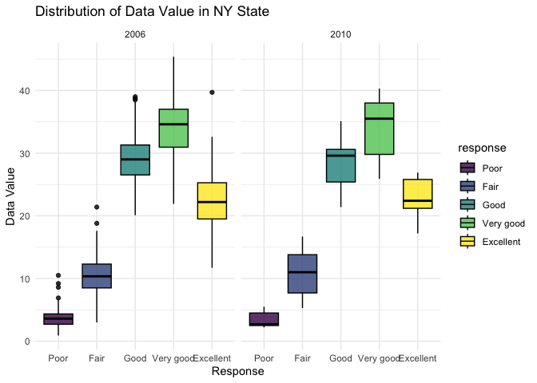

P8105_hw3_yw4200
================
yh
2023-10-05

## Problem 1

This problem uses the Instacart data. DO NOT include this dataset in
your local data directory; instead, load the data from the
p8105.datasets using:

``` r
library(p8105.datasets)
data("instacart")
summary(instacart)
```

    ##     order_id         product_id    add_to_cart_order   reordered     
    ##  Min.   :      1   Min.   :    1   Min.   : 1.000    Min.   :0.0000  
    ##  1st Qu.: 843370   1st Qu.:13380   1st Qu.: 3.000    1st Qu.:0.0000  
    ##  Median :1701880   Median :25298   Median : 7.000    Median :1.0000  
    ##  Mean   :1706298   Mean   :25556   Mean   : 8.758    Mean   :0.5986  
    ##  3rd Qu.:2568023   3rd Qu.:37940   3rd Qu.:12.000    3rd Qu.:1.0000  
    ##  Max.   :3421070   Max.   :49688   Max.   :80.000    Max.   :1.0000  
    ##     user_id         eval_set          order_number      order_dow    
    ##  Min.   :     1   Length:1384617     Min.   :  4.00   Min.   :0.000  
    ##  1st Qu.: 51732   Class :character   1st Qu.:  6.00   1st Qu.:1.000  
    ##  Median :102933   Mode  :character   Median : 11.00   Median :3.000  
    ##  Mean   :103113                      Mean   : 17.09   Mean   :2.701  
    ##  3rd Qu.:154959                      3rd Qu.: 21.00   3rd Qu.:5.000  
    ##  Max.   :206209                      Max.   :100.00   Max.   :6.000  
    ##  order_hour_of_day days_since_prior_order product_name          aisle_id    
    ##  Min.   : 0.00     Min.   : 0.00          Length:1384617     Min.   :  1.0  
    ##  1st Qu.:10.00     1st Qu.: 7.00          Class :character   1st Qu.: 31.0  
    ##  Median :14.00     Median :15.00          Mode  :character   Median : 83.0  
    ##  Mean   :13.58     Mean   :17.07                             Mean   : 71.3  
    ##  3rd Qu.:17.00     3rd Qu.:30.00                             3rd Qu.:107.0  
    ##  Max.   :23.00     Max.   :30.00                             Max.   :134.0  
    ##  department_id      aisle            department       
    ##  Min.   : 1.00   Length:1384617     Length:1384617    
    ##  1st Qu.: 4.00   Class :character   Class :character  
    ##  Median : 8.00   Mode  :character   Mode  :character  
    ##  Mean   : 9.84                                        
    ##  3rd Qu.:16.00                                        
    ##  Max.   :21.00

``` r
head(instacart,10)
```

    ##    order_id product_id add_to_cart_order reordered user_id eval_set
    ## 1         1      49302                 1         1  112108    train
    ## 2         1      11109                 2         1  112108    train
    ## 3         1      10246                 3         0  112108    train
    ## 4         1      49683                 4         0  112108    train
    ## 5         1      43633                 5         1  112108    train
    ## 6         1      13176                 6         0  112108    train
    ## 7         1      47209                 7         0  112108    train
    ## 8         1      22035                 8         1  112108    train
    ## 9        36      39612                 1         0   79431    train
    ## 10       36      19660                 2         1   79431    train
    ##    order_number order_dow order_hour_of_day days_since_prior_order
    ## 1             4         4                10                      9
    ## 2             4         4                10                      9
    ## 3             4         4                10                      9
    ## 4             4         4                10                      9
    ## 5             4         4                10                      9
    ## 6             4         4                10                      9
    ## 7             4         4                10                      9
    ## 8             4         4                10                      9
    ## 9            23         6                18                     30
    ## 10           23         6                18                     30
    ##                                     product_name aisle_id department_id
    ## 1                               Bulgarian Yogurt      120            16
    ## 2  Organic 4% Milk Fat Whole Milk Cottage Cheese      108            16
    ## 3                          Organic Celery Hearts       83             4
    ## 4                                 Cucumber Kirby       83             4
    ## 5           Lightly Smoked Sardines in Olive Oil       95            15
    ## 6                         Bag of Organic Bananas       24             4
    ## 7                           Organic Hass Avocado       24             4
    ## 8                    Organic Whole String Cheese       21            16
    ## 9                  Grated Pecorino Romano Cheese        2            16
    ## 10                                  Spring Water      115             7
    ##                            aisle   department
    ## 1                         yogurt   dairy eggs
    ## 2           other creams cheeses   dairy eggs
    ## 3               fresh vegetables      produce
    ## 4               fresh vegetables      produce
    ## 5            canned meat seafood canned goods
    ## 6                   fresh fruits      produce
    ## 7                   fresh fruits      produce
    ## 8                packaged cheese   dairy eggs
    ## 9              specialty cheeses   dairy eggs
    ## 10 water seltzer sparkling water    beverages

The goal is to do some exploration of this dataset. To that end, write a
short description of the dataset, noting the size and structure of the
data, describing some key variables, and giving illstrative examples of
observations.

Answer: The dataset describes some order information and product
information about instcart. The dataset has 1384617 observations and 15
variables. The key variables include `order_id`, `product_id`,
`add_to_cart_order`, `reordered`, `user_id`, `eval_set` etc. Considering
about the illstrative examples of observations, i think that each
observation is arranged in a confusing order.

Then, do or answer the following (commenting on the results of each):

How many aisles are there, and which aisles are the most items ordered
from?

``` r
# count number of aisles
unique_aisles <- unique(instacart$aisle)
num_aisles <- length(unique_aisles)

# count number of different kinds of aisles
library(dplyr)
```

    ## 
    ## Attaching package: 'dplyr'

    ## The following objects are masked from 'package:stats':
    ## 
    ##     filter, lag

    ## The following objects are masked from 'package:base':
    ## 
    ##     intersect, setdiff, setequal, union

``` r
aisle_group <- instacart |>
  group_by(aisle) |>
  summarize(total_items = n()) |>
  arrange(desc(total_items))

# select aisle which the most items ordered from
most_items <- aisle_group |>
  filter(aisle_group$total_items == max(aisle_group$total_items))
most_items
```

    ## # A tibble: 1 × 2
    ##   aisle            total_items
    ##   <chr>                  <int>
    ## 1 fresh vegetables      150609

Answer: There are 134 aisles. Fresh vegetables are the most items
ordered from.

Make a plot that shows the number of items ordered in each aisle,
limiting this to aisles with more than 10000 items ordered. Arrange
aisles sensibly, and organize your plot so others can read it.

``` r
# select aisles with more than 10000 items ordered
aisle_filtergroup <- aisle_group |>
  filter(total_items > 10000)

# Make a plot that shows the number of items ordered in each aisle
library(ggplot2)
items_number_in_aisles <-
  ggplot(aisle_filtergroup, aes(x = reorder(aisle,-total_items), y = total_items)) +
  geom_bar(stat = "identity", fill = "seagreen3") +
  labs(
    title = "Number of items ordered in each aisle",
    x = "Aisle",
    y = "Total items"
  ) +
  theme(
    axis.text.x = element_text(angle = 45, hjust = 1)
  ) +
  geom_text(aes(label = total_items), vjust = -1, size = 1.3, color = "black")

items_number_in_aisles
```

<!-- -->

Make a table showing the three most popular items in each of the aisles
“baking ingredients”, “dog food care”, and “packaged vegetables fruits”.
Include the number of times each item is ordered in your table.

``` r
# count the number of items and arrange 
popular_items <- instacart |> 
  filter(aisle %in% c("baking ingredients" , "dog food care", "packaged vegetables fruits") )  |>
  group_by(product_name,aisle) |>
  summarise(items_number = n(),.groups = "drop_last") |>
  arrange(aisle,desc(items_number)) 

# select the three most popular items
top_items <- popular_items %>%
  group_by(aisle) %>%
  mutate(rank = rank(desc(items_number))) %>%
  filter(rank <= 3)

knitr::kable(top_items, caption = "The three most popular items in each of the aisles")
```

| product_name                                  | aisle                      | items_number | rank |
|:----------------------------------------------|:---------------------------|-------------:|-----:|
| Light Brown Sugar                             | baking ingredients         |          499 |    1 |
| Pure Baking Soda                              | baking ingredients         |          387 |    2 |
| Cane Sugar                                    | baking ingredients         |          336 |    3 |
| Snack Sticks Chicken & Rice Recipe Dog Treats | dog food care              |           30 |    1 |
| Organix Chicken & Brown Rice Recipe           | dog food care              |           28 |    2 |
| Small Dog Biscuits                            | dog food care              |           26 |    3 |
| Organic Baby Spinach                          | packaged vegetables fruits |         9784 |    1 |
| Organic Raspberries                           | packaged vegetables fruits |         5546 |    2 |
| Organic Blueberries                           | packaged vegetables fruits |         4966 |    3 |

The three most popular items in each of the aisles

Make a table showing the mean hour of the day at which Pink Lady Apples
and Coffee Ice Cream are ordered on each day of the week; format this
table for human readers (i.e. produce a 2 x 7 table).

``` r
library(tidyr)
# first filter the Pink Lady Apples and Coffee Ice Cream and rearrange
table_mean_hour <- instacart |>
  filter(product_name %in% c("Pink Lady Apples" , "Coffee Ice Cream")) |>
  group_by(product_name,order_dow) |>
  summarise(mean_hour = mean(order_hour_of_day),.groups = "drop_last") 

# change the value of order_dow
table_mean_hour <- table_mean_hour %>%
  mutate(
    order_dow = case_when(
      order_dow == 0 ~ "Monday",
      order_dow == 1 ~ "Tuesday",
      order_dow == 2 ~ "Wednesday",
      order_dow == 3 ~ "Thursday",
      order_dow == 4 ~ "Friday",
      order_dow == 5 ~ "Saturday",
      order_dow == 6 ~ "Sunday"
    )
  )

# change the table more readable
pivot_table <- table_mean_hour|>
  pivot_wider(names_from = order_dow, values_from = mean_hour) |>
  mutate(across(everything(), ~round(., 2)))

knitr::kable(pivot_table, caption = "The mean hour of the day")
```

| product_name     | Monday | Tuesday | Wednesday | Thursday | Friday | Saturday | Sunday |
|:-----------------|-------:|--------:|----------:|---------:|-------:|---------:|-------:|
| Coffee Ice Cream |  13.77 |   14.32 |     15.38 |    15.32 |  15.22 |    12.26 |  13.83 |
| Pink Lady Apples |  13.44 |   11.36 |     11.70 |    14.25 |  11.55 |    12.78 |  11.94 |

The mean hour of the day

## Problem 2

This problem uses the BRFSS data. DO NOT include this dataset in your
local data directory; instead, load the data from the p8105.datasets
package.

``` r
data("brfss_smart2010")
unique(brfss_smart2010$Response)
```

    ##  [1] "Excellent"                                 
    ##  [2] "Very good"                                 
    ##  [3] "Good"                                      
    ##  [4] "Fair"                                      
    ##  [5] "Poor"                                      
    ##  [6] "Good or Better Health"                     
    ##  [7] "Fair or Poor Health"                       
    ##  [8] "Yes"                                       
    ##  [9] "No"                                        
    ## [10] "Yes, pregnancy-related"                    
    ## [11] "No, pre-diabetes or borderline diabetes"   
    ## [12] "Smoke everyday"                            
    ## [13] "Smoke some days"                           
    ## [14] "Former smoker"                             
    ## [15] "Never smoked"                              
    ## [16] "Neither overweight nor obese (BMI le 24.9)"
    ## [17] "Overweight (BMI 25.0-29.9)"                
    ## [18] "Obese (BMI 30.0 - 99.8)"                   
    ## [19] "Checked in past 5 years"                   
    ## [20] "Not Checked in past 5 years"               
    ## [21] "Never Checked"                             
    ## [22] "Consume 5 or more times per day"           
    ## [23] "Consume less than 5 times per day"

First, do some data cleaning: format the data to use appropriate
variable names; focus on the “Overall Health” topic; include only
responses from “Excellent” to “Poor”; organize responses as a factor
taking levels ordered from “Poor” to “Excellent”

``` r
brfss_clean <- brfss_smart2010 |>
  janitor::clean_names() |>
  rename(loc_abbreviation = locationabbr,loc_desc = locationdesc) |>
  filter(topic == "Overall Health") |>
  filter(response %in% c("Excellent","Very good","Good","Fair","Poor")) |>
  mutate(response = factor(response, levels = c("Poor", "Fair", "Good", "Very good", "Excellent"),ordered = TRUE))
```

Using this dataset, do or answer the following (commenting on the
results of each):

In 2002, which states were observed at 7 or more locations? What about
in 2010?

``` r
# states were observed at 7 or more locations in 2002
brfss_clean_2002 <- brfss_clean |>
  filter(year == 2002) |>
  group_by(loc_abbreviation) |>
  summarise(num_location = n_distinct(loc_desc)) |>
  filter(num_location >= 7) |>
  arrange(desc(num_location)) 

brfss_clean_2002
```

    ## # A tibble: 6 × 2
    ##   loc_abbreviation num_location
    ##   <chr>                   <int>
    ## 1 PA                         10
    ## 2 MA                          8
    ## 3 NJ                          8
    ## 4 CT                          7
    ## 5 FL                          7
    ## 6 NC                          7

``` r
# states were observed at 7 or more locations in 2010
brfss_clean_2010 <- brfss_clean |>
  filter(year == 2010) |>
  group_by(loc_abbreviation) |>
  summarise(num_location = n_distinct(loc_desc)) |>
  filter(num_location >= 7) |>
  arrange(desc(num_location))

brfss_clean_2010
```

    ## # A tibble: 14 × 2
    ##    loc_abbreviation num_location
    ##    <chr>                   <int>
    ##  1 FL                         41
    ##  2 NJ                         19
    ##  3 TX                         16
    ##  4 CA                         12
    ##  5 MD                         12
    ##  6 NC                         12
    ##  7 NE                         10
    ##  8 WA                         10
    ##  9 MA                          9
    ## 10 NY                          9
    ## 11 OH                          8
    ## 12 CO                          7
    ## 13 PA                          7
    ## 14 SC                          7

PA, MA, NJ, CT, FL, NC were observed at 7 or more locations in 2002;FL,
NJ, TX, CA, MD, NC, NE, WA, MA, NY, OH, CO, PA, SC were observed at 7 or
more locations in 2010.

Construct a dataset that is limited to Excellent responses, and
contains, year, state, and a variable that averages the data_value
across locations within a state. Make a “spaghetti” plot of this average
value over time within a state (that is, make a plot showing a line for
each state across years – the geom_line geometry and group aesthetic
will help).

``` r
# Construct the dataset
brfss_filter <- brfss_clean |>
  filter(response == "Excellent") |> 
  rename(state = loc_abbreviation) |>
  group_by(year,state) |>
  summarise(avg_data_value = mean(data_value, na.rm = TRUE))
```

    ## `summarise()` has grouped output by 'year'. You can override using the
    ## `.groups` argument.

``` r
# Make a “spaghetti” plot
ggplot(brfss_filter, aes(x = year, y = avg_data_value, group = state, color = state)) +
  geom_line() +
  labs(
  title = "Average data value over time within a state",
  x = "Year",
  y = "Average Data Value"
  )
```

<!-- -->

Make a two-panel plot showing, for the years 2006, and 2010,
distribution of data_value for responses (“Poor” to “Excellent”) among
locations in NY State.

``` r
data_twopanel <- brfss_clean |>
  filter(year == 2006 | year == 2010 & loc_abbreviation == "NY") 

# Create a two-panel plot
two_panel_plot <- ggplot(data_twopanel, aes(x = response, y = data_value)) +
  geom_boxplot(aes(fill = response),color = "black",alpha = 0.8) +
  facet_wrap(~ year, ncol = 2) +
  labs(title = "Distribution of Data Value in NY State",
       x = "Response",
       y = "Data Value")  +
  theme_minimal()

two_panel_plot
```

    ## Warning: Removed 4 rows containing non-finite values (`stat_boxplot()`).

<!-- -->
\## Problem 3 Accelerometers have become an appealing alternative to
self-report techniques for studying physical activity in observational
studies and clinical trials, largely because of their relative
objectivity. During observation periods, the devices can measure MIMS in
a short period; one-minute intervals are common. Because accelerometers
can be worn comfortably and unobtrusively, they produce around-the-clock
observations.

This problem uses accelerometer data collected on 250 participants in
the NHANES study. The participants’ demographic data can be downloaded
here, and their accelerometer data can be downloaded here. Variables
\*MIMS are the MIMS values for each minute of a 24-hour day starting at
midnight.

Load, tidy, merge, and otherwise organize the data sets. Your final
dataset should include all originally observed variables; exclude
participants less than 21 years of age, and those with missing
demographic data; and encode data with reasonable variable classes
(i.e. not numeric, and using factors with the ordering of tables and
plots in mind).

``` r
demo_data = read.csv("./local_data/nhanes_covar.csv",skip = 4)
accel_data = read.csv("./local_data/nhanes_accel.csv")


# filter demographic data
demo_clean <- demo_data |>
  janitor::clean_names() |>
  filter(age >= 21 & !is.na(age) & !is.na(sex) & !is.na(education)) |>
  mutate(sex = case_when(
    sex == 1 ~ "male", 
    sex == 2 ~ "female")) |>
  mutate(education = case_when(
    education == 1 ~ "Less than high school",
    education == 2 ~ "High school equivalent",
    education == 3 ~ "More than high school"
  )) |>
  mutate(sex = factor(sex, levels = c("male","female"), ordered = TRUE)) |>
  mutate(education = factor(education, levels = c("Less than high school", "High school equivalent", "More than high school"), ordered = TRUE))


# change accelerometer data more readable
accel_clean <- accel_data |>
    janitor::clean_names() |> 
  pivot_longer(min1:min1440,
               names_to = "minute",
               names_prefix = "min",
               values_to = "mims_value") |>
     mutate(minute = as.numeric(minute))

merge_data <- inner_join(demo_clean, accel_clean, by = "seqn") |>
  na.omit()
```

Produce a reader-friendly table for the number of men and women in each
education category, and create a visualization of the age distributions
for men and women in each education category. Comment on these items.

``` r
# table for the number of men and women in each education category
education_data <- merge_data |> 
  pivot_wider(
    names_from = minute,
    values_from = mims_value
  ) |>
  group_by(sex, education) |> 
  janitor::tabyl(education,sex) 

education_data |> 
  knitr::kable(digits = 2)
```

| education              | male | female |
|:-----------------------|-----:|-------:|
| Less than high school  |   27 |     28 |
| High school equivalent |   35 |     23 |
| More than high school  |   56 |     59 |

``` r
# a visualization of the age distributions for men and women in each education category
age_distribution_plot <- ggplot(merge_data, aes(x = education, y = age,fill = sex)) +
  geom_boxplot(color = "black",alpha = 0.6) +
  labs(title = "The age distributions",
       x = "Education Level",
       y = "Age")  +
  theme(axis.text.x = element_text(size = 10))

age_distribution_plot
```

<!-- -->

``` r
# comments: based on the table for the number of men and women in each education category，we can see that among participants, the number of female with education "more than high school" is most, which is 59; the number of male with education "more than high school" is 56. More details are shown in the table. Based on the plot, we can see that the average age of males whose education are "more than high school" is about 43, which is the youngest group among education level. The same for the female. The average age of males whose education are "less than high school" is about 57, which is the oldest group among education level. The average age of females whose education are "less than high school" and females whose education are "high school" are similar, which is about 63. 
```

Traditional analyses of accelerometer data focus on the total activity
over the day. Using your tidied dataset, aggregate across minutes to
create a total activity variable for each participant. Plot these total
activities (y-axis) against age (x-axis); your plot should compare men
to women and have separate panels for each education level. Include a
trend line or a smooth to illustrate differences. Comment on your plot.

``` r
# prepare the data for the plot
total_activity <- merge_data |>
  group_by(seqn,age,sex,education) |>
  summarise(total_activity = sum(mims_value))
```

    ## `summarise()` has grouped output by 'seqn', 'age', 'sex'. You can override
    ## using the `.groups` argument.

``` r
#draw total activity plot
total_activity_plot <- ggplot(total_activity,aes(x = age,y = total_activity,color = sex)) +
  geom_point(alpha = 0.8) +
  geom_smooth(se = FALSE) +
  facet_grid(~ education) +
  labs(title = "Total Activities against Age",
       x = "Age",
       y = "MIMS Value") 

total_activity_plot
```

    ## `geom_smooth()` using method = 'loess' and formula = 'y ~ x'

<!-- -->

``` r
# Comment: Based on this point plot, we can know that although participants likely appear to be dispersed, total activity times for the three groups with different levels of education showed a decreasing trend. People in the group "Less than high school" tends to decline more as age increases. We can also see in the graph the difference in activity time with age between men and women, with men fluctuating less relative to women.
```

Accelerometer data allows the inspection activity over the course of the
day. Make a three-panel plot that shows the 24-hour activity time
courses for each education level and use color to indicate sex. Describe
in words any patterns or conclusions you can make based on this graph;
including smooth trends may help identify differences.

``` r
# make the three panel plot
three_panel_plot1 <- merge_data |> 
  ggplot(aes(x = minute, y = mims_value, color = sex)) +
  geom_point(alpha = 0.1) +
  geom_smooth() +
  facet_grid(~ education) +
  labs(
    title = "24-Hour Activity Time Courses",
    x = "24-Hour Minutes",
    y = "Activity time"
  ) +
  theme(legend.position = "bottom") 

# get the mean of mims value per day in order to see a more clear change
three_panel_plot2 <- merge_data |> 
  group_by(minute, sex, education) |> 
  summarise(mean_mims_value = mean(mims_value)) |> 
  ggplot(aes(x = minute, y = mean_mims_value, color = sex)) +
  geom_point(alpha = 0.1) +
  geom_smooth() +
  facet_grid(~ education) +
  labs(
    title = "24-Hour Activity Time Courses",
    x = "24-Hour Minutes",
    y = "Activity time"
  ) +
  theme(legend.position = "bottom") 
```

    ## `summarise()` has grouped output by 'minute', 'sex'. You can override using the
    ## `.groups` argument.

``` r
three_panel_plot1
```

    ## `geom_smooth()` using method = 'gam' and formula = 'y ~ s(x, bs = "cs")'

<!-- -->

``` r
three_panel_plot2
```

    ## `geom_smooth()` using method = 'gam' and formula = 'y ~ s(x, bs = "cs")'

<!-- -->

``` r
# Conclusions: The overall distribution of overall activity time is more similar for different levels of education and for different genders, with a gradual increase starting after the 300th minute, leveling off at the 500th-1200th minute, and then starting to decline. The overall fluctuations in activity time for participants with education higher than high school were more volatile than for participants with other levels of education, with males peaking at around the 1100th minute.
```
